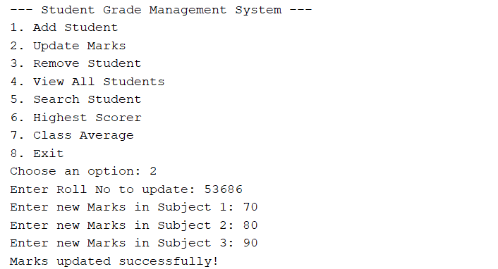
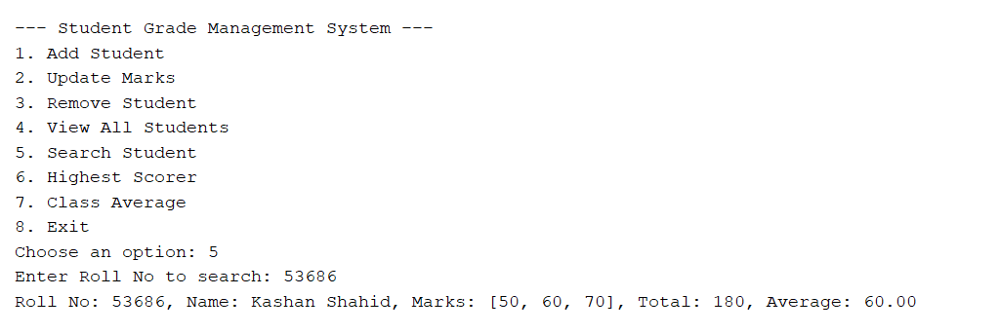

# Student Grade Management System

This is a simple **menu-driven console application in Java** to manage student grades.  
It was created as **Assignment #1** for the course *Advanced Computer Programming (BSCS)*.

---

## 👨‍💻 Author
- Name: Kashan Shahid 53686 
- University: Riphah International University  
- Course: Advanced Computer Programming (BSCS)  

---

## 📌 Features
- Add Student (with validation: max 50 students, unique roll number, marks between 0–100)  
- Update Marks (search by roll number)  
- Remove Student  
- View All Students (tabular format with total & average)  
- Search Student (by roll number)  
- Highest Scorer  
- Class Average  
- Exit (summary shown on exit)  

---

## 📸 Screenshots

### Adding a Student


### Adding another Student


### Viewing All Students


### Updating Marks of a Student



### Remove Student


### Remove Student



## 🛠️ How to Run
1. Clone this repository:
   ```bash
   git clone https://github.com/kashan980/StudentGradeManagementSystem.git
